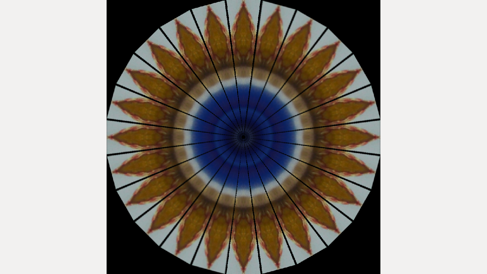
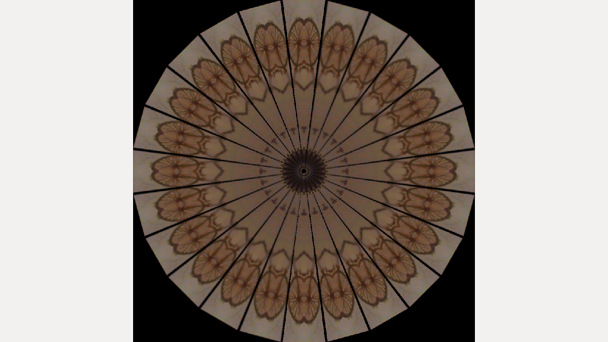
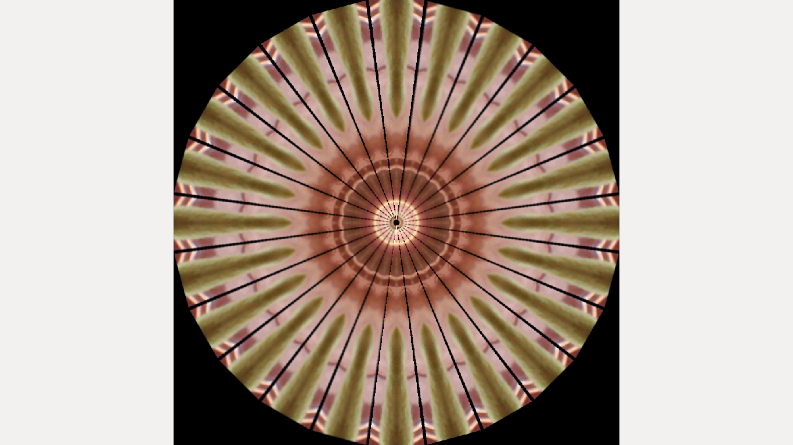

# Virtual-Kaleidoscope

This is a perfect example coagulation of Nature and Technology

Project was Funded by Unicef

Pipeline:

RasberryPi Feed --> OpenCV C++ code --> Image processing --> Projector projection of Realtime Video

Credits :

Industrial Design Centre, IIT Bombay 
